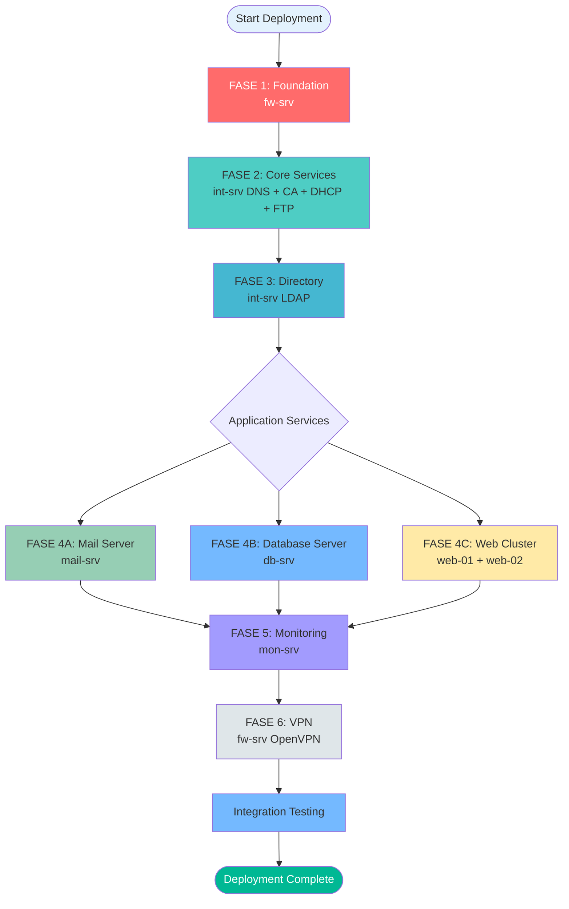

# Deployment Flow - LKS 2025

## Optimal Deployment Sequence

Urutan deployment ini dirancang berdasarkan **dependency antar service** untuk memastikan efisiensi maksimal dan meminimalkan rework.



## Fase-Fase Deployment

### FASE 1: Foundation Layer ⚡
**Estimasi: 30-45 menit**

#### 1. fw-srv (Firewall & Routing)
**Dependency:** NONE  
**Prioritas:** CRITICAL

**Konfigurasi:**
- ✅ Network interfaces (4 interfaces: WAN, INT, DMZ, MGMT)
- ✅ IP forwarding & routing tables
- ✅ nftables firewall rules
- ✅ NAT (SNAT/MASQUERADE) untuk INT & DMZ zones
- ✅ Zone-based filtering

**Kenapa Pertama?**
- Semua traffic antar zone harus melalui firewall
- Tanpa routing yang benar, service lain tidak bisa berkomunikasi
- NAT diperlukan untuk internet access dari internal zones

**Command:**
```bash
cd services/01-firewall
sudo ./auto-config.sh --explain
sudo ./auto-check.sh --verbose
```

---

### FASE 2: Core Services 🔧
**Estimasi: 45-60 menit**

#### 2. int-srv - DNS Server (Bind9)
**Dependency:** fw-srv (routing)  
**Prioritas:** HIGH

**Konfigurasi:**
- ✅ Bind9 installation & configuration
- ✅ Forward zone: lksn2025.id
- ✅ Reverse zones: 27.168.192, 1.168.192, 1.16.172, 0.0.10
- ✅ DNS records (A, PTR, MX, CNAME)
- ✅ Forwarders untuk external DNS
- ✅ DNSSEC (optional)

**Kenapa Sekarang?**
- Semua service memerlukan name resolution
- FQDN diperlukan untuk certificate generation
- Mail server memerlukan MX records

**Command:**
```bash
cd services/02-dns
sudo ./auto-config.sh --explain
sudo ./auto-check.sh --verbose
```

#### 3. int-srv - Certificate Authority (OpenSSL)
**Dependency:** DNS (untuk FQDN)  
**Prioritas:** HIGH

**Konfigurasi:**
- ✅ Root CA creation
- ✅ Intermediate CA (optional)
- ✅ Certificate generation untuk semua services
  - mail-srv.lksn2025.id
  - web-01.lksn2025.id
  - web-02.lksn2025.id
  - fw.lksn2025.id (untuk VPN)
- ✅ CRL (Certificate Revocation List)

**Kenapa Sekarang?**
- SSL/TLS certificates diperlukan untuk semua services
- Mail server memerlukan cert untuk SMTPS/IMAPS
- Web server memerlukan cert untuk HTTPS
- VPN memerlukan cert untuk authentication

**Command:**
```bash
cd services/03-ca
sudo ./auto-config.sh --explain
sudo ./auto-check.sh --verbose
```

---

### FASE 3: Directory Services 👥
**Estimasi: 30-45 menit**

#### 4. int-srv - LDAP Directory (slapd)
**Dependency:** DNS, CA (untuk LDAPS)  
**Prioritas:** MEDIUM

**Konfigurasi:**
- ✅ OpenLDAP (slapd) installation
- ✅ Directory structure (dc=lksn2025,dc=id)
- ✅ Organizational Units (users, groups, services)
- ✅ User accounts & groups
- ✅ LDAPS (LDAP over SSL)
- ✅ Access Control Lists (ACL)
- ✅ Password policies

**Kenapa Sekarang?**
- Centralized authentication untuk semua services
- Mail server memerlukan LDAP untuk virtual users
- Web server memerlukan LDAP untuk authentication
- Harus sebelum application services

**Command:**
```bash
cd services/04-ldap
sudo ./auto-config.sh --explain
sudo ./auto-check.sh --verbose
```

---

### FASE 4: Application Services 🚀
**Estimasi: 60-90 menit (parallel)**

> **Note:** Mail dan Web bisa dikonfigurasi **parallel** karena tidak ada dependency satu sama lain

#### 5A. mail-srv (Mail Server) - PRIORITY #1
**Dependency:** DNS, CA, LDAP  
**Prioritas:** MEDIUM

**Konfigurasi:**
- ✅ Postfix (SMTP server)
  - SMTP authentication via LDAP
  - TLS/SSL support
  - Virtual mailbox domains
  - SPF, DKIM, DMARC
- ✅ Dovecot (IMAP server)
  - IMAP over SSL
  - LDAP authentication
  - Mailbox storage
- ✅ Roundcube (Webmail)
  - Web interface
  - LDAP address book
  - SSL/HTTPS

**Command:**
```bash
cd services/05-mail
sudo ./auto-config.sh --explain
sudo ./auto-check.sh --verbose
```

#### 5B. web-01 & web-02 (Web Cluster) - PRIORITY #2
**Dependency:** DNS, CA, LDAP  
**Prioritas:** MEDIUM

**Konfigurasi:**
- ✅ Keepalived (High Availability)
  - Virtual IP: 172.16.1.20
  - VRRP protocol
  - Health checks
  - Automatic failover
- ✅ HAProxy (Load Balancer)
  - Backend server pool
  - Health monitoring
  - Session persistence
  - SSL termination
- ✅ Web Server (Apache/Nginx)
  - Virtual hosts
  - LDAP authentication
  - SSL/HTTPS
  - Application deployment

**Command:**
```bash
# Deploy web-01 (Master)
cd services/06-web-cluster
sudo ./auto-config.sh --host web-01 --explain

# Deploy web-02 (Backup)
sudo ./auto-config.sh --host web-02 --explain

# Validate cluster
sudo ./auto-check.sh --cluster --verbose
```

---

### FASE 5: VPN & Security 🔐
**Estimasi: 30 menit**

#### 6. fw-srv - OpenVPN Server
**Dependency:** CA (untuk certificates)  
**Prioritas:** LOW (bisa terakhir)

**Konfigurasi:**
- ✅ OpenVPN server installation
- ✅ Server configuration (UDP 1194)
- ✅ Certificate-based authentication
- ✅ VPN network: 10.10.0.0/24
- ✅ Routing ke INT & DMZ zones
- ✅ Client configuration files
- ✅ Firewall rules untuk VPN

**Command:**
```bash
cd services/07-vpn
sudo ./auto-config.sh --explain
sudo ./auto-check.sh --verbose
```

---

## Automated Deployment

### Deploy All (Sequential)
```bash
cd orchestrator
sudo ./deploy-all.sh --interactive
```

Output:
```
[1/6] Deploying fw-srv (Firewall)... ✓ Complete
[2/6] Deploying int-srv (DNS)... ✓ Complete
[3/6] Deploying int-srv (CA)... ✓ Complete
[4/6] Deploying int-srv (LDAP)... ✓ Complete
[5/6] Deploying mail-srv... ✓ Complete
[6/6] Deploying web-cluster... ✓ Complete

Deployment completed successfully!
Run './check-all.sh' to validate configuration.
```

### Deploy All (Fast Mode - Parallel where possible)
```bash
sudo ./deploy-all.sh --fast
```

### Validate All
```bash
sudo ./check-all.sh --report
```

Output:
```
=== LKS 2025 Configuration Validation Report ===

[✓] fw-srv (Firewall & Routing)
    ├─ [✓] Network interfaces configured
    ├─ [✓] Firewall rules loaded
    ├─ [✓] NAT configuration active
    └─ [✓] Routing tables correct

[✓] int-srv (DNS Server)
    ├─ [✓] Bind9 service running
    ├─ [✓] Forward zone lksn2025.id
    ├─ [✓] Reverse zones configured
    └─ [✓] DNS resolution working

[✓] int-srv (Certificate Authority)
    ├─ [✓] Root CA created
    ├─ [✓] Certificates generated
    └─ [✓] CRL configured

[✓] int-srv (LDAP Directory)
    ├─ [✓] slapd service running
    ├─ [✓] Directory structure created
    ├─ [✓] LDAPS enabled
    └─ [✓] User authentication working

[✓] mail-srv (Mail Server)
    ├─ [✓] Postfix SMTP running
    ├─ [✓] Dovecot IMAP running
    ├─ [✓] Roundcube accessible
    └─ [✓] Mail flow working

[✓] web-cluster (HA Web Servers)
    ├─ [✓] Keepalived VIP active (172.16.1.20)
    ├─ [✓] HAProxy load balancing
    ├─ [✓] Web servers responding
    └─ [✓] Failover tested

Overall Status: ✓ ALL SYSTEMS OPERATIONAL
```

---

## Time Estimates

| Deployment Type | Estimated Time |
|----------------|----------------|
| **Manual (Sequential)** | 4-5 hours |
| **With Automation (Sequential)** | 1.5-2 hours |
| **With Automation (Parallel)** | 1-1.5 hours |
| **Validation Only** | 15-20 minutes |

---

## Rollback Strategy

Jika ada error di tengah deployment:

```bash
cd orchestrator
sudo ./rollback.sh --to-phase 3
```

Ini akan rollback semua konfigurasi setelah fase 3, sehingga Anda bisa fix error dan deploy ulang dari fase tersebut.

---

## Troubleshooting

Jika deployment gagal di fase tertentu:

1. **Check logs:**
   ```bash
   tail -f /var/log/lks-automation/deployment.log
   ```

2. **Run validation:**
   ```bash
   cd services/[failed-service]
   sudo ./auto-check.sh --verbose --debug
   ```

3. **Review documentation:**
   ```bash
   cat services/[failed-service]/docs.md
   ```

4. **Check troubleshooting guide:**
   ```bash
   cat docs/troubleshooting.md
   ```

---

**Next:** Lihat [Quick Start Guide](../docs/quick-start.md) untuk mulai deployment.
