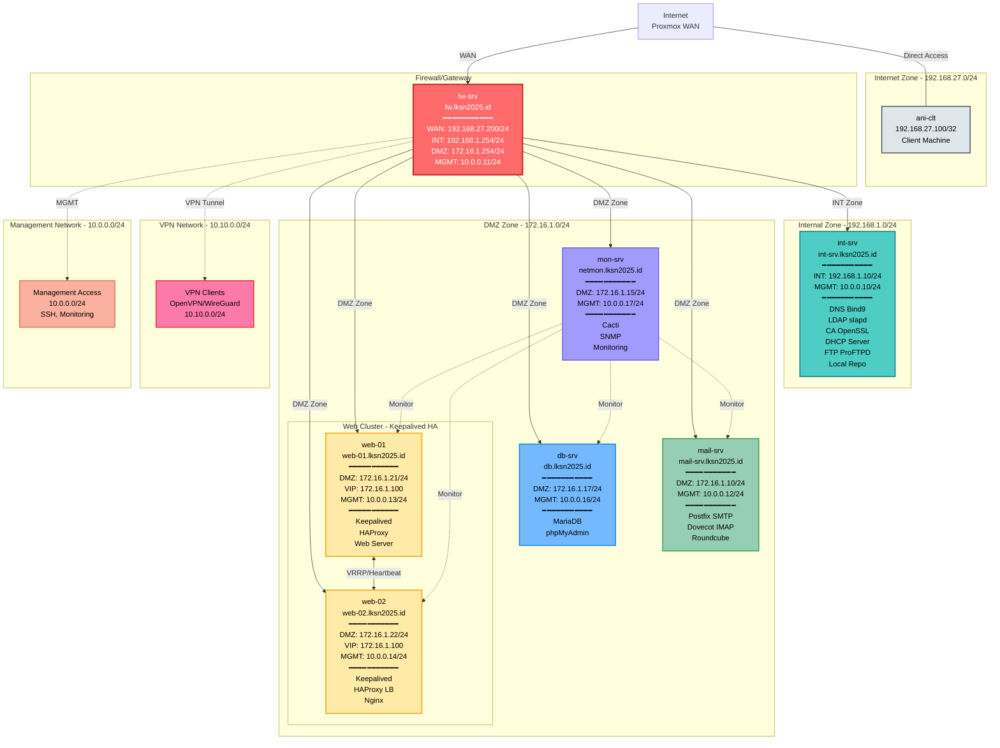

# Network Topology - LKS 2025

## Topology Overview



## Network Zones

| Zone Name | Network | Gateway | Purpose |
|-----------|---------|---------|---------|
| **Internet** | 192.168.27.0/24 | 192.168.27.1 | WAN connection (Proxmox) |
| **INT-Zone** | 192.168.1.0/24 | 192.168.1.254 (fw-srv) | Internal services |
| **DMZ-Zone** | 172.16.1.0/24 | 172.16.1.254 (fw-srv) | Public-facing services |
| **VPN** | 10.10.0.0/24 | 10.10.0.1 (fw-srv) | VPN clients |
| **MGMT** | 10.0.0.0/24 | 10.0.0.1 (fw-srv) | Management access |

## IP Allocation Table

| Hostname | FQDN | Internet | INT-Zone | DMZ-Zone | MGMT | Services |
|----------|------|----------|----------|----------|------|----------|
| **fw-srv** | fw.lksn2025.id | 192.168.27.200/24 | 192.168.1.254/24 | 172.16.1.254/24 | 10.0.0.11/24 | Firewall (nftables)<br/>VPN Server (OpenVPN/WireGuard)<br/>Router |
| **int-srv** | int-srv.lksn2025.id | - | 192.168.1.10/24 | - | 10.0.0.10/24 | DNS Server (Bind9)<br/>LDAP Directory (slapd)<br/>Certificate Authority (OpenSSL)<br/>DHCP Server<br/>FTP Server (ProFTPD)<br/>Local Repository |
| **mail-srv** | mail-srv.lksn2025.id | - | - | 172.16.1.10/24 | 10.0.0.12/24 | Mail Server (Postfix/SMTP)<br/>IMAP Server (Dovecot)<br/>Webmail (Roundcube) |
| **db-srv** | db.lksn2025.id | - | - | 172.16.1.17/24 | 10.0.0.16/24 | Database (MariaDB)<br/>phpMyAdmin |
| **mon-srv** | netmon.lksn2025.id | - | - | 172.16.1.15/24 | 10.0.0.17/24 | Monitoring (Cacti)<br/>SNMP Daemon<br/>Network Monitoring |
| **web-01** | web-01.lksn2025.id | - | - | 172.16.1.21/24 | 10.0.0.13/24 | Virtual IP (Keepalived)<br/>Load Balancer (HAProxy)<br/>Web Server |
| **web-02** | web-02.lksn2025.id | - | - | 172.16.1.22/24 | 10.0.0.14/24 | Virtual IP (Keepalived)<br/>Load Balancer (HAProxy)<br/>Web Server (Nginx) |
| **ani-clt** | ani-clt.lksn2025.id | 192.168.27.100/32 | - | - | 10.0.0.15/24 | Client Machine |
| **VIP** | vip.lksn2025.id | - | - | 172.16.1.100/24 | - | Web Cluster Virtual IP |

## Traffic Flow

### Internet Access
```
ani-clt → Internet (Direct)
INT-Zone → fw-srv (NAT) → Internet
DMZ-Zone → fw-srv (NAT) → Internet
```

### Service Access from Client
```
Client → fw-srv → DMZ-Zone → Web Cluster (VIP)
Client → fw-srv → DMZ-Zone → Mail Server
Client → fw-srv → INT-Zone → DNS Server
```

### Inter-Service Communication
```
Mail Server → fw-srv → INT-Zone → DNS (name resolution)
Mail Server → fw-srv → INT-Zone → LDAP (authentication)
Web Cluster → fw-srv → INT-Zone → DNS (name resolution)
Web Cluster → fw-srv → INT-Zone → LDAP (authentication)
```

## Firewall Zones & Rules

### Zone Definitions
- **WAN** (Internet): Untrusted, incoming connections restricted
- **INT** (Internal): Trusted, full access to services
- **DMZ**: Semi-trusted, limited access to internal
- **MGMT**: Management only, SSH access
- **VPN**: VPN clients, controlled access

### Default Policies
- WAN → DMZ: ALLOW (specific ports only)
- WAN → INT: DROP
- DMZ → INT: ALLOW (DNS, LDAP only)
- INT → DMZ: ALLOW
- INT → WAN: ALLOW (NAT)
- DMZ → WAN: ALLOW (NAT)

## High Availability Setup

### Web Cluster (Keepalived)
- **Virtual IP**: 172.16.1.20/24
- **Master**: web-01 (priority 100)
- **Backup**: web-02 (priority 90)
- **VRRP**: Authentication, health checks
- **Failover**: Automatic within 2 seconds

## VPN Configuration

### OpenVPN Server (fw-srv)
- **Protocol**: UDP 1194
- **Network**: 10.10.0.0/24
- **Server IP**: 10.10.0.1
- **Client Range**: 10.10.0.10 - 10.10.0.250
- **Authentication**: Certificate-based (CA from int-srv)
- **Routing**: Access to INT and DMZ zones

## DNS Zones

### Forward Zones
- **lksn2025.id**: Primary domain
  - fw.lksn2025.id → 192.168.27.200
  - int-srv.lksn2025.id → 192.168.1.10
  - mail-srv.lksn2025.id → 172.16.1.10
  - db.lksn2025.id → 172.16.1.17
  - netmon.lksn2025.id → 172.16.1.15
  - web-01.lksn2025.id → 172.16.1.21
  - web-02.lksn2025.id → 172.16.1.22
  - www.lksn2025.id → 192.168.27.200 (NAT to VIP)
  - vip.lksn2025.id → 172.16.1.100 (Keepalived VIP)
  - mail.lksn2025.id → 172.16.1.10
  - vpn.lksn2025.id → 192.168.27.200
  - phpmyadmin.lksn2025.id → 172.16.1.17
  - webmail.lksn2025.id → mail-srv.lksn2025.id (CNAME)
  - cacti.lksn2025.id → netmon.lksn2025.id (CNAME)

### Reverse Zones
- **27.168.192.in-addr.arpa** (Internet zone)
  - 200.27.168.192.in-addr.arpa → fw.lksn2025.id
  - 100.27.168.192.in-addr.arpa → ani-clt.lksn2025.id
- **1.168.192.in-addr.arpa** (INT zone)
  - 10.1.168.192.in-addr.arpa → int-srv.lksn2025.id
  - 254.1.168.192.in-addr.arpa → fw.lksn2025.id
- **1.16.172.in-addr.arpa** (DMZ zone)
  - 10.1.16.172.in-addr.arpa → mail-srv.lksn2025.id
  - 15.1.16.172.in-addr.arpa → netmon.lksn2025.id
  - 17.1.16.172.in-addr.arpa → db.lksn2025.id
  - 21.1.16.172.in-addr.arpa → web-01.lksn2025.id
  - 22.1.16.172.in-addr.arpa → web-02.lksn2025.id
  - 100.1.16.172.in-addr.arpa → vip.lksn2025.id
  - 254.1.16.172.in-addr.arpa → fw.lksn2025.id
- **0.0.10.in-addr.arpa** (MGMT zone)
  - 10.0.0.10.in-addr.arpa → int-srv.lksn2025.id
  - 11.0.0.10.in-addr.arpa → fw.lksn2025.id
  - 12.0.0.10.in-addr.arpa → mail-srv.lksn2025.id
  - 13.0.0.10.in-addr.arpa → web-01.lksn2025.id
  - 14.0.0.10.in-addr.arpa → web-02.lksn2025.id
  - 15.0.0.10.in-addr.arpa → ani-clt.lksn2025.id
  - 16.0.0.10.in-addr.arpa → db.lksn2025.id
  - 17.0.0.10.in-addr.arpa → netmon.lksn2025.id

## Proxmox Network Bridges

Untuk setup di Proxmox, buat network bridges:

| Bridge | VLAN | Network | Purpose | VMs |
|--------|------|---------|---------|-----|
| vmbr0 | - | 192.168.27.0/24 | Internet (WAN) | fw-srv, ani-clt |
| vmbr1 | 10 | 192.168.1.0/24 | Internal Zone | fw-srv, int-srv |
| vmbr2 | 20 | 172.16.1.0/24 | DMZ Zone | fw-srv, mail-srv, db-srv, mon-srv, web-01, web-02 |
| vmbr3 | 99 | 10.0.0.0/24 | Management | All VMs (8 total) |

### VM Summary
- **Total VMs:** 8
- **fw-srv:** 4 interfaces (vmbr0, vmbr1, vmbr2, vmbr3)
- **int-srv:** 2 interfaces (vmbr1, vmbr3)
- **mail-srv:** 2 interfaces (vmbr2, vmbr3)
- **db-srv:** 2 interfaces (vmbr2, vmbr3)
- **mon-srv:** 2 interfaces (vmbr2, vmbr3)
- **web-01:** 2 interfaces (vmbr2, vmbr3)
- **web-02:** 2 interfaces (vmbr2, vmbr3)
- **ani-clt:** 2 interfaces (vmbr0, vmbr3)

---

**Note**: Topologi ini menggunakan internet dari Proxmox host (192.168.27.0/24) sebagai WAN, sehingga tidak perlu konfigurasi internet connection tambahan.
